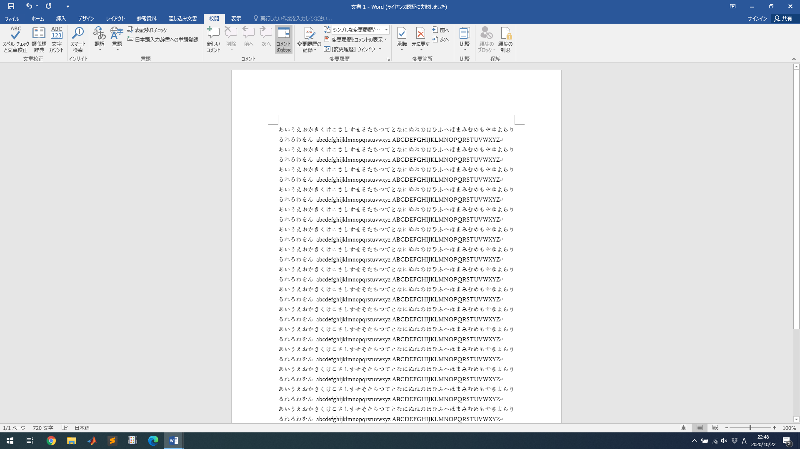
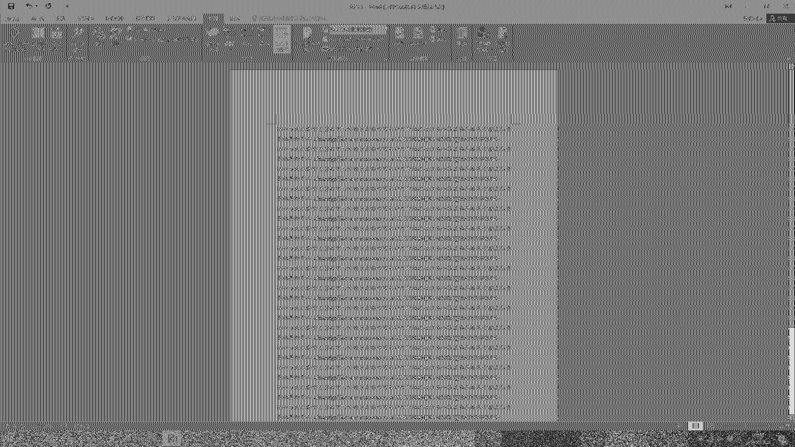
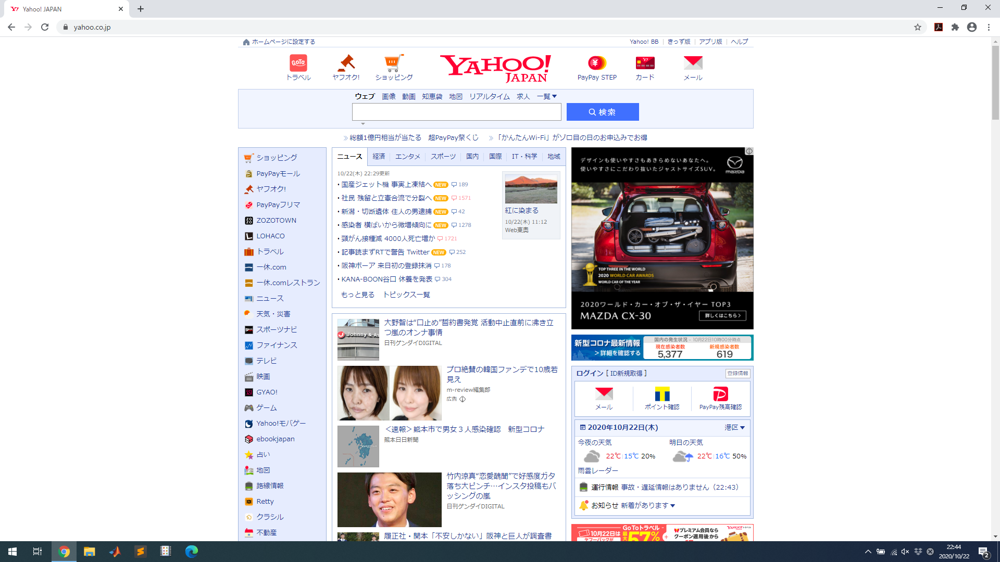
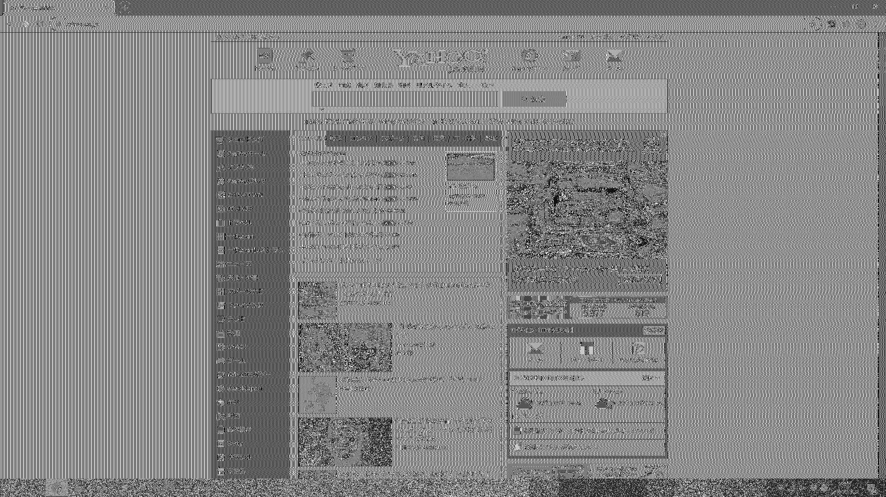

# TMDS_TEMPEST_Simulator
HDMI TEMPEST 再構築画像シミュレータ

TMDS信号については[こちら](https://github.com/daianjibetu/TMDS_Signal_Simulator)を参照  

画像をアップロードすると、グレースケールに変換された後、画像の再構築が行われます。
   

## 実行結果
 

表示画像①
  

再構築画像①
  

表示画像②
  

再構築画像②
  
